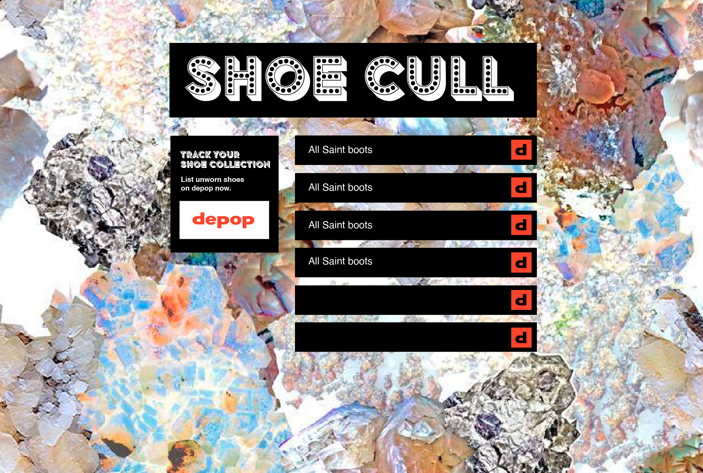

# shoeCull

A shoe collection App with CRUD functionality with a comprehensive list of worn and unworn shoes so you can keep track of your shoe collection.

## Tech stack

* Node (v18.12)
* NPM (8.19.2)
* Jest (v29.3.1) for unit testing on the backend.

* Mongoose to model objects in MongoDB.
* Nodemon (2.0.20) to reload the server automatically.
* React Spring (v9.2.4) for animations.

## User Stories
```
As a shoecull user
So I can keeo track of my shoes.
I would like to understand to be clear on worn and unworn shoes.
```

```
As a shoecull user
So I can easily resell my shoes on depop
I would like to click on a link and list shoes to depop 
```

```
As a shoecull user
So I can update my my shoe collection
I would like to keep my entry up to date and current 
```

## Diagrams

### Wireframe


### Backend Diagram

### Frontend Diagram